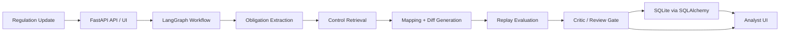
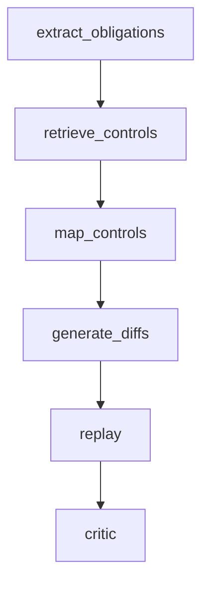

# ControlDiff

ControlDiff is an agentic compliance workflow for fintech onboarding teams. It ingests a regulatory update, extracts atomic obligations, maps them to internal controls, proposes policy-level change artifacts, replays expected downstream impact on onboarding cases, and routes uncertain runs into a human review loop.

This repo is intentionally built as a strong MVP:

- it runs locally in WSL2 without requiring an OpenAI API key
- it exposes both JSON APIs and an analyst-facing UI
- it preserves citations, replay context, review history, and workflow state
- it uses graph orchestration rather than a single opaque script

## What problem it solves

Compliance and operations teams often receive regulatory change in unstructured form:

- bulletins
- policy notices
- guidance updates
- internal control revisions

The hard part is not just extracting the text. The hard part is answering:

1. What exactly changed?
2. Which internal controls are impacted?
3. What policy or SOP changes are implied?
4. What downstream onboarding behavior might change?
5. Does the result look strong enough to trust, or should a human review it?

ControlDiff is built to model that full workflow.

## Why this project is interesting

Many “AI compliance” demos stop at extraction. ControlDiff goes further:

1. Parse a regulation update into structured obligations
2. Retrieve candidate controls and policies
3. Generate mapped control impacts and policy diffs
4. Replay likely downstream effect on onboarding cases
5. Score confidence and trigger a human review loop
6. Surface everything in an analyst dashboard

That makes it much closer to a real operational tool than a standalone prompt.

## Demo Mode vs OpenAI Mode

ControlDiff is designed to be useful even without paid model access.

- `Local Demo`: deterministic heuristic/graph pipeline, no OpenAI key required
- `OpenAI Mode`: optional future upgrade path for one or more workflow nodes

This is a strength for a portfolio project because reviewers can run the full system locally without being blocked by API billing.

## Product scope

The current MVP focuses on **US fintech AML onboarding controls**:

- Customer Identification Program (CIP)
- Know Your Customer (KYC)
- Beneficial ownership
- Sanctions screening
- Manual review SOP changes

Primary user:

- compliance lead
- risk operations analyst
- onboarding policy owner at a fintech startup

## Core user flow

1. Analyst submits a bulletin, rule update, or internal policy notice
2. Graph workflow extracts atomic obligations
3. Candidate controls are retrieved and scored
4. Mapping node proposes impacted controls and rationales
5. Diff, replay, and critic nodes produce a final run report
6. Analyst approves or rejects the run in the UI

## System design

### Architecture overview



### Workflow graph



### Major components

- `FastAPI`
  Handles JSON APIs, HTML UI routes, metrics, and review actions.
- `LangGraph`
  Orchestrates the multi-step workflow as an explicit state machine.
- `SQLAlchemy`
  Persists workflow runs, regulations, obligations, mappings, and review decisions.
- `Prometheus`
  Tracks run counts and workflow duration.
- `Jinja`
  Renders a lightweight analyst dashboard without a frontend build pipeline.

## Repository structure

```text
src/controldiff/
  agents/          Graph state, nodes, prompts, schemas
  api/             FastAPI app and routers
  db/              SQLAlchemy base and session helpers
  domain/          Models, enums, DTOs
  evals/           Evaluation helpers
  ingestion/       Chunking, parsers, loaders
  observability/   Metrics and tracing hooks
  replay/          Replay fixtures, engine, scoring
  retrieval/       Retrieval helpers and Qdrant interfaces
  services/        Workflow, report, review, and demo services
  web/             Jinja templates and static UI assets
  workers/         Background entry points
docs/              Product notes, architecture, evaluation plan, demo script
tests/             Unit, integration, and smoke coverage
```

## Local setup

### 1. Use WSL2 and the Linux filesystem

Do not build inside `/mnt/c/...`. Use a native WSL path like:

```bash
mkdir -p ~/projects/ControlDiff
cd ~/projects/ControlDiff
```

### 2. Bootstrap the environment

```bash
git config --global core.autocrlf input
cp .env.example .env
bash scripts/bootstrap.sh
source .venv/bin/activate
```

### 3. Start the app

```bash
make run
```

Open:

- API docs: `http://localhost:8000/docs`
- Analyst UI: `http://localhost:8000/ui/runs`
- Metrics: `http://localhost:8000/metrics`

## Testing

Run the full suite:

```bash
make test
```

Current coverage includes:

- unit tests for extraction, retrieval, graph behavior, and replay helpers
- integration tests for API runs and report/review flow
- smoke tests for the analyst UI

## Key API endpoints

- `GET /health/liveness`
- `GET /health/readiness`
- `POST /api/v1/runs`
- `GET /api/v1/runs`
- `GET /api/v1/runs/{run_id}`
- `GET /api/v1/runs/{run_id}/report`
- `POST /api/v1/runs/{run_id}/review`

## Analyst UI

The server-rendered UI supports:

- dashboard view of recent workflow runs
- sample run loader for recruiter demos
- ad hoc demo run creation from pasted regulation text
- run detail pages with obligations, mappings, critic notes, replay summary, and review history
- approve/reject workflow directly from the browser

## Example demo scenarios

These work well in local demo mode:

- `CDD Rule Update - Beneficial Ownership`
- `CIP Verification Bulletin`
- `Enhanced Due Diligence Notice`

They show different mixes of:

- beneficial ownership extraction
- sanctions matching
- identity verification logic
- manual review escalation language

## Design choices

### Why graph orchestration?

The workflow is naturally multi-stage and stateful. `LangGraph` makes it easier to:

- keep intermediate artifacts explicit
- add review and critic branches later
- test nodes independently
- replace heuristic nodes with model-backed nodes incrementally

### Why no frontend framework yet?

For an MVP and portfolio project, server-rendered UI is the fastest way to deliver:

- a working product surface
- low setup friction
- a clean demo experience

without adding a second application stack.

### Why local-first defaults?

This project is meant to be runnable by:

- recruiters
- reviewers
- collaborators
- future you

without needing paid cloud dependencies on day one.

## Known limitations

- extraction and mapping are still mostly heuristic
- policy diffs are lightweight rather than fully semantic
- replay uses seeded synthetic fixtures
- SQLite is used for local development rather than PostgreSQL migrations
- Qdrant integration exists architecturally but lexical retrieval still carries most of the local demo load

## Roadmap

Planned upgrades:

1. stronger sample/demo controls and seeded reports
2. exportable Markdown or JSON analyst report
3. OpenAI-backed structured extraction node
4. richer replay evaluation and confidence calibration
5. PostgreSQL + Alembic migrations
6. improved retrieval ranking with embeddings or hybrid search

## What this demonstrates

This project is a strong portfolio artifact because it shows:

- product thinking
- system design
- agent workflow orchestration
- backend API design
- human-in-the-loop review patterns
- practical local developer experience
- demo-friendly UI polish

## Additional docs

- [Architecture](docs/architecture.md)
- [Product Spec](docs/product-spec.md)
- [Evaluation Plan](docs/evaluation-plan.md)
- [Demo Script](docs/demo-script.md)

## License

MIT
